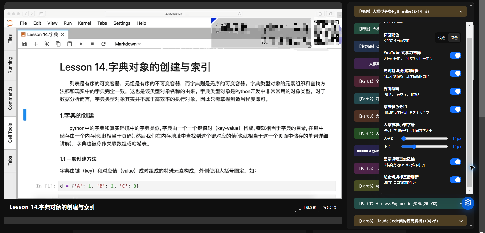
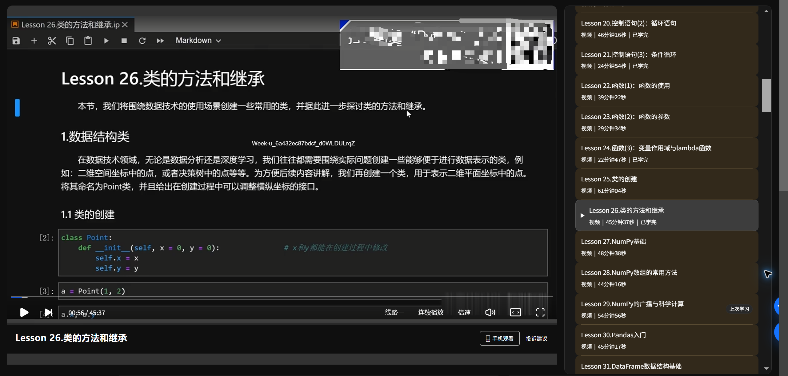

# 小鹅通课程页面增强

一个用于改善小鹅通 PC 课程页面学习体验的用户脚本。

## 效果预览

### 设置面板与章节彩色分组

### 深色播放器与完整课程目录

## 功能

- 将视频播放页调整为类似 YouTube 的双栏学习布局：左侧大播放器，右侧独立滚动课程目录。
- 点击同课程中的视频课时，只重新创建课程播放器和课程数据，不刷新整个网页。
- 播放器“下一集”按钮和自动连播也会直接切换左侧播放器，不重新加载整页。
- 自动连播时课程目录保持稳定，并可通过齿轮上方的定位按钮将当前小节滚动到目录中央。
- 定位与设置按钮默认隐藏在页面右侧边缘，鼠标靠近按钮周围或右侧滚动条时自动滑出。
- 在播放器下方显示当前课程名称；目录只高亮当前播放课程，并显示播放图标。
- 展开的章节完整显示所有课程，目录统一在右侧滚动，并使用细分割线整理课程层级。
- “上次学习”标签会跟随刚刚播放的课程并显示在课程项末尾。
- 可在设置中开启或关闭低饱和度的章节彩色分组，不同大章节及其小节使用不同色系。
- 可在设置中分别调整大章节和小节字号；目录使用更醒目的宽滚动条。
- 支持浏览器后退、前进切换已经访问过的视频课时。
- 在浅色和深色页面配色之间切换；深色模式中的课程文字统一使用白色。
- 为切课、目录悬停和设置面板增加平滑动画，并自动尊重系统的“减少动态效果”设置。
- 将已解锁、可访问的课程标题增强为真实链接。鼠标悬停时显示下划线，并支持浏览器原生的右键菜单、中键和 `Ctrl`/`Command` 点击。
- 可选阻止课程页面在切换浏览器标签后自动刷新。
- 设置会保存在当前小鹅通站点的浏览器本地存储中。

## 安装

1. 安装 Tampermonkey 或 Violentmonkey。
2. 安装 [`小鹅通课程页面增强.user.js`](./小鹅通课程页面增强.user.js)。
3. 重新打开小鹅通 PC 课程页面。
4. 点击页面右下方的齿轮按钮调整配色和功能开关。

[从 Greasy Fork 安装脚本](https://greasyfork.org/zh-CN/scripts/593938-%E5%B0%8F%E9%B9%85%E9%80%9A%E8%AF%BE%E7%A8%8B%E9%A1%B5%E9%9D%A2%E5%A2%9E%E5%BC%BA)

## 说明

- 仅在小鹅通 PC 课程详情页运行。
- 双栏布局和无刷新播放目前仅应用于视频课程；其他内容类型继续使用小鹅通原生跳转。
- 无刷新切课只销毁并重建小鹅通原生播放器实例，右侧目录和页面主体保持不变；不会绕过进度、权限或付费逻辑。
- 如果页面结构变化或组件重建失败，脚本会自动退回普通网页跳转。
- 修改“防止切换标签后刷新”后，需要刷新当前页面才能完全生效。
- 课程链接仅根据小鹅通页面已经提供的课程数据生成，不会为锁定或无权访问的课程添加链接。
- 不收集数据，也不会发送额外的网络请求。
- 不绕过登录、付费或课程访问权限。
- 首次使用时请确认课程进度仍能正常保存。

## 反馈

[提交问题](https://github.com/laoedo/xiaoe-no-reload/issues)

## 许可证

[MIT](./LICENSE)
